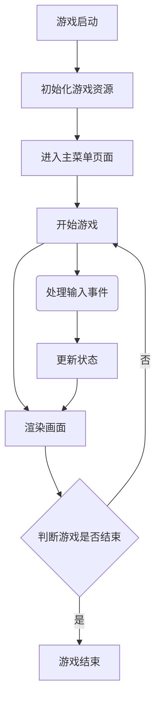

# <center>OOP大作业 贪吃蛇游戏</center>

<center>马颢宸 23307110426</center>

<center>2025/6/1</center>

---

## 背景介绍

### 贪吃蛇游戏任务


### 所用技术

* 使用SFML库设置游戏开发
  * 使用`sf::Sprite`、`sf::Text`、`sf::CircleShape`等进行图形文本渲染与变换、形状绘制
  * 使用`sf::Music`等进行音乐播放与音效处理
  * 使用`sf::Mouse::getPosition`等进行输入输出管理
  * 使用`sf::Clock` 和 `sf::Time`控制游戏帧率和时间相关逻辑
* 使用C++语言，面向对象编程
  * 设置继承、封装、多态、组合等C++高级特性。
  * 设置智能指针`std::shared_ptr<Screen>`管理游戏屏幕，确保安全的状态转换，避免内存泄漏。
  * 设置STL容器存储，利用随机算法和分布类生成随机数
* 使用CMake构建系统，管理SFML依赖


## 算法解释

### 核心流程



**文字描述**

运行程序后，首先进入`MenuScreen`页面，页面包含四个选项，分别可进入`ModeSceen`、`OptionScreen`、`HelpScreen`以及退出游戏。

`OptionScreen`页面可以设置游戏背景、控制音乐。

`HelpScreen`页面有简单的游戏介绍。

`ModeScreen`页面有三个选项，可分别开启三种不同的游戏模式：经典模式`Classic`、对战模式`Battle`、无敌模式`Invincible`

任意模式开启后，可进入`GameScreen`页面，进行贪吃蛇游戏

`GameScreen`页面可进入`PauseScreen`页面，其中可选择返回`MenuScreen`页面、重新开始游戏、继续游戏、结束游戏或进入`HelpScreen`、`OptionScreen`页面

游戏结束后进入`GameOverScreen`页面，当前页面可选择结束游戏、重新开始游戏、返回`MenuScreen`页面


### 重要代码

#### 游戏界面管理 `Screen`

* Screen作为所有游戏界面的基类，通过纯虚函数定义接口，让子类实现其具体行为

  ```cpp
  class Screen
  {
  public:
  	virtual void handleInput(sf::RenderWindow& window) = 0;
  	virtual void update(sf::Time delta) = 0;
  	virtual void render(sf::RenderWindow& window) = 0;
  
  };
  ```

* 使用智能指针管理游戏界面状态，并实现界面切换

  ```cpp
  class Game
  {
  public:
      // 使用静态共享指针管理当前屏幕和临时屏幕
      static std::shared_ptr<Screen> MainScreen;
      static std::shared_ptr<Screen> TmpScreen;
      static std::shared_ptr<Screen> TmpGameScreen;
      // ...
  };
  
  // 示例：从游戏界面切换到暂停界面
  void GameScreen::handleInput(sf::RenderWindow& window)
  {
  	snake.handleInput(window);
      if (Game::CurrentMode == GameMode::Battle) {
          snakeP2.handleInput(window);
      }
  	auto mousePosition = sf::Mouse::getPosition(window);
      pauseButton.focused(false);
      if (pauseButton.contain(mousePosition))
      {
          pauseButton.focused(true);
          if (
              !Game::mouseButtonLocked &&
              sf::Mouse::isButtonPressed(sf::Mouse::Left))
          {
              Game::mouseButtonCDtime = sf::Time::Zero;
              Game::mouseButtonLocked = true;
              Game::TmpGameScreen = Game::MainScreen;
              Game::MainScreen = std::make_shared<PauseScreen>();
              return;
          }
      }
  }
  ```

* 子界面类

  1. **MenuScreen**：主菜单界面，提供游戏入口
  2. **ModeScreen**：游戏模式选择界面
  3. **GameScreen**：主游戏界面，负责游戏运行
  4. **PauseScreen**：暂停界面，可跳转多个界面
  5. **GameOverScreen**：游戏结束界面
  6. **HelpScreen**：帮助界面，提供游戏介绍
  7. **OptionScreen**：设置界面，设置游戏背景及音效

  每个界面都实现了三个核心函数

  ```cpp
  //示例：GameScreen
  void GameScreen::handleInput(sf::RenderWindow& window)
  {
  	snake.handleInput(window);
      if (Game::CurrentMode == GameMode::Battle) {
          snakeP2.handleInput(window);
      }
  	auto mousePosition = sf::Mouse::getPosition(window);
      pauseButton.focused(false);
      if (pauseButton.contain(mousePosition))
      {
          pauseButton.focused(true);
          if (
              !Game::mouseButtonLocked &&
              sf::Mouse::isButtonPressed(sf::Mouse::Left))
          {
              Game::mouseButtonCDtime = sf::Time::Zero;
              Game::mouseButtonLocked = true;
              Game::TmpGameScreen = Game::MainScreen;
              Game::MainScreen = std::make_shared<PauseScreen>();
              return;
          }
      }
  }
  
  void GameScreen::update(sf::Time delta)
  {
  	while (fruit.size() < 10){
  		generateFruit();
  	}
  
  	snake.update(delta);
  	snake.checkFruitCollisions(fruit);
  
      if (Game::CurrentMode == GameMode::Battle) {
          snakeP2.update(delta);
          snakeP2.checkFruitCollisions(fruit);
  
          // 检查死亡
          if (snake.hitOtherSnake(snakeP2) || snake.hitSelf() || snake.hitbomb()) {
              dieSound_.play();
              sf::sleep(sf::seconds(dieBuffer_.getDuration().asSeconds()));
              if(snake.hitOtherSnake(snakeP2) || snake.hitbomb()){
                  Game::MainScreen = std::make_shared<GameOverScreen>(0, snakeP2.getscore());
              }else if(snake.hitSelf()){
                  Game::MainScreen = std::make_shared<GameOverScreen>(snake.getscore(), snakeP2.getscore());
              }
              return;
          }
  // ……
  
  }
  
  void GameScreen::render(sf::RenderWindow& window)
  {
  	if (Game::GridVisibility){
          grid.render(window);
  	}
      snake.render(window);
      if (Game::CurrentMode == GameMode::Battle) {
          snakeP2.render(window);
      }
      for (auto fruit : fruit){
          fruit.render(window);
      }	
      pauseButton.render(window);
  //……
  }
  ```

* 设计优势

  * 内存安全：使用智能指针自动管理内存，避免内存泄漏
  * 多态性：利用基类指针和虚函数实现多态
  * 状态隔离：每个屏幕状态独立封装，降低耦合
  * 状态保存：通过 `TmpScreen` 临时保存前一个状态


#### 贪吃蛇管理 `Snake`

* Snake 类是游戏的核心类，负责蛇的所有行为和状态

  ```cpp
  namespace sfSnake
  {
      typedef sf::Vector2f Dir;
      typedef sf::Vector2f Bodypath;
  
      struct SnakeStyle {
          std::string headPath;
          sf::Color firstColor;
          sf::Color secondColor;
      };
  
      class Snake
      {
      public:
          Snake(bool isPlayerTwo = false);
          void handleInput(sf::RenderWindow& window);
          void update(sf::Time delta);
          void render(sf::RenderWindow& window);
          void checkFruitCollisions(std::deque<Fruit>& 		//……
  
      private:
          void move();
          void grow(int score);
          void shrink(int count);
         //……
          sf::Clock shrinkClock_;   //自动减少计时器
          sf::Clock freezeClock_;   // 冻结计时器
          bool isShrinkFrozen_;      
          void updateAutoShrink();
  
          void updateRadius(int lengthChange); 
          const float MIN_RADIUS = 10.0f;        
          const float MAX_RADIUS = 20.0f;
  
          static const std::vector<SnakeStyle> styles_;
          int currentStyle_;
          void initStyle();
          bool isPlayerTwo_;
      };
  }
  ```

* 蛇的移动算法

  蛇的移动基于一个双端队列`deque`的数据结构

  * 在队列前端添加新的头部位置
  * 在队列后端移除尾部节点（除非蛇在生长）
  * 使用方向向量计算新头部位置

  ```cpp
  //移动
  void Snake::move()
  {
      Bodypath &head = bodypath.front();
      int speed = isSpeedingUp_ ? 2 : 1;
      for (int i = 1; i <= speed; i++)
      {
          bodypath.push_front(Bodypath(
              head.x + direction_.x * i * body_r / 5.0,
              head.y + direction_.y * i * body_r / 5.0));
          if (tail)
              tail--;
          else
              bodypath.pop_back();
      }
  }
  ```

* 蛇的身体构造

  设置`SnakeNode`类表示蛇身体各个节点的基础组件，封装了蛇身体每个部分的视觉表现和物理属性，构成蛇整体的基本单元。

  采用面向对象设计中的==组合模式==思想，使蛇可以由多个节点组合形成

  ```cpp
  namespace sfSnake
  {
  class SnakeNode
  {
  public:
  	SnakeNode(float radius);
  	void setFillColor(const sf::Color& color);
  	void render(sf::RenderWindow& window, const sf::Vector2f& position, float angle, size_t index);
  	float getRadius() const;
  	void setNodeColors(const sf::Color& firstColor, const sf::Color& secondColor);
  	sf::Color getFirstColor() const;
      sf::Color getSecondColor() const;
  
  private:
  	sf::CircleShape first_body;
  	sf::CircleShape second_body;
  	float body_r;
  };
  }
  ```

  * 设计特点
    1. **封装性**：`SnakeNode` 类将蛇节点的视觉表现和物理属性封装在一起，提供清晰的接口。
    2. **单一职责原则**：该类只负责表示和管理单个蛇节点，不涉及蛇的整体行为。
    3. **可定制性**：通过构造函数参数和设置方法，可以灵活配置节点的外观和属性。
    4. **与 SFML 集成**：该类使用 SFML 的图形对象，无缝集成到游戏的渲染系统中。

* 蛇的生长算法

  蛇的生长实现是程序的核心算法之一，涉及多个相互关联的方面，包括节点增加、分数计算、体型变化和移动速度调整等

  * 生长触发算法

    蛇的生长在吃到水果后触发，通过`checkFruitCollisions`函数实现

    ```cpp
    void Snake::checkFruitCollisions(std::deque<Fruit> &fruits)
    {
        auto toRemove = fruits.end();
        Bodypath headNode = bodypath.front();
        sf::Vector2f head = toWindow(headNode);
        for (auto it = fruits.begin(); it != fruits.end(); ++it)
        {
        //……
            if (distance < body_r + it->getRadius()) {
                FruitType type = it->getType();
    	//……
                } else {
                    grow(it->getScore());
                    isShrinkFrozen_ = true;
                    freezeClock_.restart();
                }
                toRemove = it;
                break;
            }
        }
        //……
    }
    ```

  * 核心生长算法 `grow`

    当蛇吃到正常水果（非甜甜圈、炸弹）时，会调用`grow`实现生长

    ```cpp
    void Snake::grow(int score)
    {
        int lengthIncrease = score * 10;
        tail += lengthIncrease;
        score_ += score;
        updateRadius(lengthIncrease);
    }
    ```

  * 生长实现 `tail`

    蛇的实际生长是在`move`函数中实现的，通过在每一帧中调用该函数实现生长

    ```cpp
    void Snake::move()
    {
        Bodypath &head = bodypath.front();
        //……
            bodypath.push_front(Bodypath(
                head.x + direction_.x * i * body_r / 5.0,
                head.y + direction_.y * i * body_r / 5.0));
            if (tail)
                tail--;
           //……
        }
    }
    ```

    **关键逻辑**

    1. 当`tail>0`时，表示蛇需要生长，此时添加新的头部后不删除尾部（实现向前移动的同时，尾部增加长度）

       （可理解为，先处理移动，头部+1尾部-1；再处理增长，尾部+2。总变化即为，头部+1，尾部+1）

    2. 当`tail = 0`时，表示蛇不需要再生长，此时添加新的头部同时删除尾部，保持长度不变（实现向前移动）

* 碰撞检测算法

  * 自身碰撞检测

    使用欧几里得距离公式计算头部与身体各部分之间的距离

    ```cpp
    //检查自身碰撞
    void Snake::checkSelfCollisions()
    {
        Bodypath head = toWindow(bodypath.front());
        int count = 0;
    
        for (auto i = bodypath.begin(); i != bodypath.end(); ++i, ++count)
        {
            if (count >= 30 && 
                std::sqrt(std::pow(head.x - toWindow(*i).x, 2) + 
                         std::pow(head.y - toWindow(*i).y, 2)) < 2.0f * body_r)
            {
                hitSelf_ = true;
                break;
            }
        }
    }
    ```

  * 水果碰撞检测

    同样使用欧几里得算法检测蛇头与水果之间的距离

    ```cpp
    void Snake::checkFruitCollisions(std::deque<Fruit> &fruits)
    {
        auto toRemove = fruits.end();
        Bodypath headNode = bodypath.front();
        sf::Vector2f head = toWindow(headNode);
        for (auto it = fruits.begin(); it != fruits.end(); ++it)
        {
            float distance = std::sqrt(
                std::pow(head.x - it->getPosition().x, 2) +
                std::pow(head.y - it->getPosition().y, 2));
            if (distance < body_r + it->getRadius()) {
    //……
        }
        if (toRemove != fruits.end())
        {
            pickupSound_.play();
            fruits.erase(toRemove);
        }
    }
    ```

* ==创新代码==

  * 蛇的移动 ——> 加速

    蛇吃到水果中的甜甜圈时，会得到一次加速机会

    ```cpp
    //吃水果
    void Snake::checkFruitCollisions(std::deque<Fruit> &fruits)
    {
        auto toRemove = fruits.end();
    //……
            if (distance < body_r + it->getRadius()) {
                FruitType type = it->getType();
                if (type == FruitType::Donut) {
                    speedUpCount_++;
                    isShrinkFrozen_ = true;
                    freezeClock_.restart();
    //……
    }
    ```

    通过`for`循环多次移动实现加速操作

    ```cpp
    //移动
    void Snake::move()
    {
        Bodypath &head = bodypath.front();
        int speed = isSpeedingUp_ ? 2 : 1;
        for (int i = 1; i <= speed; i++)
        {
    	//……
        }
    }
    ```

    每次加速设定时长3.0s

    ```cpp
    void Snake::trySpeedUp() {
        if (!isSpeedingUp_ && speedUpCount_ > 0) {
            isSpeedingUp_ = true;
            speedUpClock_.restart();
            speedUpCount_--;
        }
    }
    
    void Snake::update(sf::Time delta)
    {
        move();
    //……
    
        if (isSpeedingUp_ && speedUpClock_.getElapsedTime().asSeconds() > 3.0f) {
            isSpeedingUp_ = false;
        }
    //……
    }
    ```

  * 蛇的生长 ——> 缩短

    与生长相对的缩短机制，通过`shrink`函数实现

    ```cpp
    void Snake::shrink(int count)
    {
        int actualShrink = 0;
        for (int i = 0; i < count && bodypath.size() > 1; ++i) {
            bodypath.pop_back();
            actualShrink++;
        }
        if (actualShrink > 0) {
            updateRadius(-actualShrink); 
        }
    }
    ```

    * 炸毁

      吃到水果中的炸弹时，蛇身会被炸毁部分，从而急剧缩短

      ```cpp
      //吃水果
      void Snake::checkFruitCollisions(std::deque<Fruit> &fruits)
      {
          auto toRemove = fruits.end();
      //……
                  FruitType type = it->getType();
      //……
                  } else if (type == FruitType::Bomb) {
                      if (Game::CurrentMode != GameMode::Invincible) {
                          if (bodypath.size() <= 40 || score_ <= 4) {
                              hitbomb_ = true;
                              return;
                          } else {
                              // 炸弹减少身体长度
                              shrink(40);
                              score_ += -4;
                              isShrinkFrozen_ = true;
                              freezeClock_.restart();
                          }
                      }
      //……
      }
      ```

    * 自动缩减

      在经典模式和对战模式下，蛇身会随着时间自动缩短，从而增加游戏难度

      ```cpp
      void Snake::updateAutoShrink()
      {
          // 检查是否在冻结状态
          if (isShrinkFrozen_) {
              if (freezeClock_.getElapsedTime().asSeconds() >= 1.0f) {
                  isShrinkFrozen_ = false;
                  shrinkClock_.restart();  // 重置自动减少计时器
              }
              return;
          }
      
          // 每三秒进行一次自动减少
          if (shrinkClock_.getElapsedTime().asSeconds() >= 3.0f) {
              if (bodypath.size() > 10) {  
                  shrink(10);  // 减少10个单位的长度
                  score_ = score_ - 1;  
                  if(score_ == 0){
                      hitSelf_ = true;
                      return;
                  }
              }
              else{
                  hitSelf_ = true;
                  return;
              }
              shrinkClock_.restart();
          }
      }
      ```

      **主要特点**

      1. 每3秒触发一次
      2. 每次减少10个单位长度和1分
      3. 吃到水果后短暂暂停缩减（1秒冻结期）
      4. 如果分数减为0，则游戏结束

  * 蛇的生长 ——> 半径调整

    设计随着蛇身长度的改变，蛇节点的半径也会变化。实现了蛇随着长度增加而变粗的效果

    ```cpp
    //更新半径
    void Snake::updateRadius(int lengthChange) {
        float radiusChange = (lengthChange / 50.0f);  // 每50个长度单位改变1.0f半径
        float newRadius = body_r + radiusChange;
        
        // 确保半径在合理范围内
        newRadius = std::max(MIN_RADIUS, std::min(MAX_RADIUS, newRadius));
        
        if (newRadius != body_r) {
            body_r = newRadius;
            sf::Color firstColor = body.getFirstColor();
            sf::Color secondColor = body.getSecondColor();
            body = SnakeNode(body_r);  // 更新身体节点的大小
            body.setNodeColors(firstColor, secondColor);
            
            // 更新蛇头大小
            sf::Vector2u TextureSize = headTexture.getSize();
            float headScale = body_r / TextureSize.y * 2.2f;
            headSprite.setScale(headScale, headScale);
            setOriginMiddle(headSprite);
        }
    }
    ```

    **主要特点**

    1. 半径变化与长度变化成比例
    2. 设置了最小和最大半径限制，防止蛇身过小或过大
    3. 同时更新了蛇头和蛇身的视觉大小

  * 碰撞检测 ——> 蛇间碰撞检测

    在对战模式下，检测一条蛇的头部是否与另一条蛇的任何部分发生碰撞

    ```cpp
    bool Snake::hitOtherSnake(const Snake& otherSnake)
    {
        if (Game::CurrentMode != GameMode::Battle) {
            return false;
        }
        
        Bodypath head = toWindow(bodypath.front());
        
        for (auto it = otherSnake.bodypath.begin(); it != otherSnake.bodypath.end(); ++it) {
            Bodypath otherBodyPart = toWindow(*it);
            if (std::sqrt(std::pow(head.x - otherBodyPart.x, 2) + 
                        std::pow(head.y - otherBodyPart.y, 2)) < 2.0f * body_r) {
                return true;
            }
        }
        
        return false;
    }
    ```

  * 随机蛇样式

    通过随机算法和分布类随机选择蛇的样式，共设置四种样式可选

    对战模式下，除随机样式外，保证玩家一、二的两条蛇样式不同

    ```cpp
    const std::vector<sfSnake::SnakeStyle> Snake::styles_ = {
        {"Pic/head_1.png", sf::Color(0xc6ffffff), sf::Color(0x57FFFEff)},
        {"Pic/head_2.png", sf::Color(0xFF9B9DFF), sf::Color(0xFF5758FF)},
        {"Pic/head_3.png", sf::Color(0x5acb89ff), sf::Color(0x197841ff)},
        {"Pic/head_4.png", sf::Color(0xf3d9c7ff), sf::Color(0xF1B186ff)}
    };
    
    //初始化
    void Snake::initStyle()
    {
        // 使用随机设备获取随机数
        std::random_device rd;
        std::mt19937 gen(rd());
        if(Game::CurrentMode == GameMode::Classic || Game::CurrentMode == GameMode::Invincible) {
            // 经典模式或无敌模式随机选择样式
            std::uniform_int_distribution<> dis(0, styles_.size() - 1);
            currentStyle_ = dis(gen);
        } else if(Game::CurrentMode == GameMode::Battle){
            // 确保两条蛇的样式不同
            static int player1Style = -1;
            if(!isPlayerTwo_) {
                std::uniform_int_distribution<> dis(0, styles_.size() - 1);
                currentStyle_ = dis(gen);
                player1Style = currentStyle_;
            }
            else if(isPlayerTwo_) {
                std::uniform_int_distribution<> dis(0, styles_.size() - 1);
                currentStyle_ = dis(gen);
                if (player1Style != -1 && currentStyle_ == player1Style) {
                currentStyle_ = (currentStyle_ + 1) % styles_.size();
                }
            }
        }
    }
    ```

    

#### 水果管理`Fruit`

* Fruit类负责管理游戏中出现的水果（含甜甜圈与炸弹）

  ```cpp
  namespace sfSnake
  {
  enum class FruitType {
      Donut, Bomb, Apple, Pear, Peach, Strawberry, Avocado, BadMushroom, BadPotato
  };
  class Fruit
  {
  public:
      Fruit(sf::Vector2f position, FruitType type);
      void render(sf::RenderWindow& window);
      FruitType getType() const;
      int getScore() const;
      sf::Vector2f getPosition() const;
      float getRadius() const;
  private:
      FruitType type_;
      int score_;
      sf::Sprite sprite_;
      sf::Vector2f position_;
      float radius_;
      static std::map<FruitType, sf::Texture> textureMap_;
      static void loadTextures();
  };
  }
  ```

* 水果生成算法

  通过使用随机算法和分布类实现水果的随机生成

  ```cpp
  void GameScreen::generateFruit()
  {
      static std::default_random_engine engine(time(NULL));
      static std::uniform_int_distribution<int> xPos(
          Game::GlobalVideoMode.width / 15.0f,
          Game::GlobalVideoMode.width - Game::GlobalVideoMode.width / 10.0f);
      static std::uniform_int_distribution<int> yPos(
          Game::GlobalVideoMode.width / 10.0f,
          Game::GlobalVideoMode.height - Game::GlobalVideoMode.width / 15.0f);
      static std::uniform_int_distribution<int> fruitTypeDist(0, 99);
      sf::Vector2f position(xPos(engine), yPos(engine));
      int randomValue = fruitTypeDist(engine);
      if (randomValue < 5) {
          fruit.push_back(Fruit(position, FruitType::Donut)); // 5%
      } else if (randomValue < 10) {
          fruit.push_back(Fruit(position, FruitType::Bomb)); // 5%
      } else if (randomValue < 35) {
          fruit.push_back(Fruit(position, FruitType::Apple)); // 25%
      } else if (randomValue < 52) {
          fruit.push_back(Fruit(position, FruitType::Pear)); // 17%
      } else if (randomValue < 65) {
          fruit.push_back(Fruit(position, FruitType::Peach)); // 13%
      } else if (randomValue < 75) {
          fruit.push_back(Fruit(position, FruitType::Strawberry)); // 10%
      } else if (randomValue < 80) {
          fruit.push_back(Fruit(position, FruitType::Avocado)); // 5%
      } else if (randomValue < 90) {
          fruit.push_back(Fruit(position, FruitType::BadMushroom)); // 10%
      } else {
          fruit.push_back(Fruit(position, FruitType::BadPotato)); // 10%
      }
  }
  ```

* ==创新代码==

  * 水果精灵

    将水果的展示设置为图片精灵的展示

    ```cpp
    namespace {
        const std::map<FruitType, std::string> FruitTextureMap = {
            {FruitType::Donut, "Pic/donut.png"},
            {FruitType::Bomb, "Pic/bomb.png"},
            {FruitType::Apple, "Pic/apple.png"},
            {FruitType::Pear, "Pic/pear.png"},
            {FruitType::Peach, "Pic/peach.png"},
            {FruitType::Strawberry, "Pic/strawberry.png"},
            {FruitType::Avocado, "Pic/avocado.png"},
            {FruitType::BadMushroom, "Pic/bad-mushroom.png"},
            {FruitType::BadPotato, "Pic/bad-potato.png"}
        };
    //……
    }
    
    std::map<FruitType, sf::Texture> sfSnake::Fruit::textureMap_;
    
    void sfSnake::Fruit::loadTextures() {
        if (!textureMap_.empty()) return;
        for (const auto& kv : FruitTextureMap) {
            sf::Texture tex;
            if (!tex.loadFromFile(kv.second)) {
                throw std::runtime_error("Failed to load fruit texture: " + kv.second);
            }
            textureMap_.emplace(kv.first, std::move(tex));
        }
    }
    
    Fruit::Fruit(sf::Vector2f position, FruitType type)
        : type_(type), position_(position)
    {
        loadTextures();
        score_ = FruitScoreMap.at(type_);
        sprite_.setTexture(textureMap_.at(type_));
        float baseRadius = Game::GlobalVideoMode.width / 256.0f;
        radius_ = baseRadius;
        float scale = baseRadius * 5.0f / textureMap_.at(type_).getSize().x;
        sprite_.setScale(scale, scale);
        sprite_.setPosition(position_);
        sprite_.setOrigin(textureMap_.at(type_).getSize().x / 2.0f, textureMap_.at(type_).getSize().y / 2.0f);
    }
    
    void Fruit::render(sf::RenderWindow& window)
    {
        window.draw(sprite_);
    }
    
    FruitType Fruit::getType() const { return type_; }
    int Fruit::getScore() const { return score_; }
    sf::Vector2f Fruit::getPosition() const { return position_; }
    float Fruit::getRadius() const { return radius_; }
    ```

  * 水果类型及概率分布

    根据不同水果设置不同功能与分数，并根据其功能分数设置水果出现概率，调整游戏难度

    | 水果类型             | 概率 | 特性                       |
    | -------------------- | ---- | -------------------------- |
    | Donut (甜甜圈)       | 5%   | 提供加速能力               |
    | Bomb (炸弹)          | 5%   | 负面效果：缩短或致命       |
    | Apple (苹果)         | 25%  | 基础水果：增加长度和分数   |
    | Pear (梨)            | 17%  | 基础水果：增加长度和分数   |
    | Peach (桃子)         | 13%  | 基础水果：增加长度和分数   |
    | Strawberry (草莓)    | 10%  | 基础水果：增加长度和分数   |
    | Avocado (牛油果)     | 5%   | 基础水果：增加长度和分数   |
    | BadMushroom (毒蘑菇) | 10%  | 基础水果：不增加长度与分数 |
    | BadPotato (坏土豆)   | 10%  | 基础水果：不增加长度与分数 |

    ```cpp
    const std::map<FruitType, int> FruitScoreMap = {
            {FruitType::Donut, 0},
            {FruitType::Bomb, -4},
            {FruitType::Apple, 1},
            {FruitType::Pear, 2},
            {FruitType::Peach, 3},
            {FruitType::Strawberry, 4},
            {FruitType::Avocado, 5},
            {FruitType::BadMushroom, 0},
            {FruitType::BadPotato, 0}
        };
    ```

    

#### 按钮管理 `Button`

* Button类实现了游戏中的交互按钮，通过图片精灵展示

  ```cpp
  class Button
  {
  private:
      sf::Texture texture_;
      sf::Sprite sprite_;
      bool focused_;
  
  public:
      Button();
      void update(std::string filename, float scale = 1 / 8.0f);
      void setPosition(float x, float y);
  
      void focused(bool status);
      bool focused() const;
  
      template <typename T>
      bool contain(sf::Vector2<T>) const;
  
      void render(sf::RenderWindow &window) const;
  };
  ```

* OptionButton类实现了OptionScreen页面的交互按钮

  主要用于背景设置和音效设置

  ```cpp
  class OptionButton
  {
  public:
  	OptionButton() = default;
      ~OptionButton() = default;
  
      void settings(
          sf::String content,
          sf::Font &font,
          float setCharacterSize,
          sf::Vector2f position,
          sf::Color color);
      void clear();
      void focused();
      void selected();
  
      void render(sf::RenderWindow &window);
  
      template <typename T>
      bool contains(sf::Vector2<T> point);
  
  private:
  	sf::Text text_;
      sf::Color originColor_;
  };
  ```

* 背景设置

  * 背景颜色：白色、黑色、蓝色
  * 网格可开启或关闭
  * 网格颜色：白色、黑色、lanse

  ```cpp
  OptionScreen::OptionScreen()
  //……
  {
      //字体大小
      float characterSize = Game::GlobalVideoMode.width / 25.f;
  //页面定义
      float verticalSpacing = Game::GlobalVideoMode.height / 5.0f;
      float startY = Game::GlobalVideoMode.height / 7.0f;
  
      optionName_[0].settings(
          L"网格：",
          Game::GlobalFont,
          characterSize,
          sf::Vector2f(Game::GlobalVideoMode.width / 5.0f, startY + verticalSpacing),
          Game::Color::Pink);
  //……
      //开关选项
      GridShowOptions_[0].settings(
          L"关闭",
          Game::GlobalFont,
          characterSize,
          sf::Vector2f(Game::GlobalVideoMode.width / 15.0f * 11.0f, startY + verticalSpacing),
          Game::Color::NotSelected);
  //……
      //网格颜色
      GridColorOptions_[0].settings(
          L"白色",
          Game::GlobalFont,
          characterSize,
          sf::Vector2f(Game::GlobalVideoMode.width / 5.0f * 2.0f, startY + verticalSpacing * 2),
          Game::Color::NotSelected);
  //……
      //背景颜色
      BGColorOptions_[0].settings(
          L"白色",
          Game::GlobalFont,
          characterSize,
          sf::Vector2f(Game::GlobalVideoMode.width / 5.0f * 2.0f, startY + verticalSpacing * 3),
          Game::Color::NotSelected);
  //……
  
      returnButton_.update("Pic/back.png", 1 / 20.0f);
      returnButton_.setPosition(Game::GlobalVideoMode.width - Game::GlobalVideoMode.width / 15.0f, Game::GlobalVideoMode.width / 15.0f);
  }
  ```

* ==创新代码==

  * 音效设置

    音效可开启关闭，从而控制背景音乐的播放与停止

    ```cpp
    OptionScreen::OptionScreen()
    //……
    {
    //……
        optionName_[3].settings(
            L"音乐：",
            Game::GlobalFont,
            characterSize,
            sf::Vector2f(Game::GlobalVideoMode.width / 5.0f, startY),
            Game::Color::Pink);
    //……
        //音乐选项
        MusicOptions_[0].settings(
            L"关闭",
            Game::GlobalFont,
            characterSize,
            sf::Vector2f(Game::GlobalVideoMode.width / 15.0f * 11.0f, startY),
            Game::Color::NotSelected);
        MusicOptions_[1].settings(
            L"开启",
            Game::GlobalFont,
            characterSize,
            sf::Vector2f(Game::GlobalVideoMode.width / 15.0f * 7.0f, startY),
            Game::Color::NotSelected);
    //……
    }
    ```

    

#### ==创新设计==模式管理 `Mode`

* 游戏定义了三种模式，并使用枚举类表示

  ```cpp
  namespace sfSnake
  {
      enum class GameMode {
          Classic,
          Battle,
          Invincible
      };
  }
  ```

* `ModeScreen`页面负责不同模式的选择，并在`handleInput`函数中处理模式的切换

  ```cpp
  void ModeScreen::handleInput(sf::RenderWindow& window)
  {
      auto mousePosition = sf::Mouse::getPosition(window);
      
      classicButton_.focused(false);
      battleButton_.focused(false);
      invincButton_.focused(false);
      
      if (classicButton_.contain(mousePosition))
      {
          classicButton_.focused(true);
          if (sf::Mouse::isButtonPressed(sf::Mouse::Left))
          {
              Game::CurrentMode = GameMode::Classic;
              Game::MainScreen = std::make_shared<GameScreen>();
              Game::playGameModeMusic(GameMode::Classic);
              return;
          }
      }
      else if (battleButton_.contain(mousePosition))
      {
          battleButton_.focused(true);
          if (sf::Mouse::isButtonPressed(sf::Mouse::Left))
          {
              Game::CurrentMode = GameMode::Battle;
              Game::MainScreen = std::make_shared<GameScreen>();
              Game::playGameModeMusic(GameMode::Battle);
              return;
          }
      }
      else if (invincButton_.contain(mousePosition))
      {
          invincButton_.focused(true);
          if (sf::Mouse::isButtonPressed(sf::Mouse::Left))
          {
              Game::CurrentMode = GameMode::Invincible;
              Game::MainScreen = std::make_shared<GameScreen>();
              Game::playGameModeMusic(GameMode::Invincible);
              return;
          }
      }
  }
  ```

* 模式功能

  * 经典模式

    正常移动，并满足上述所有功能

  * 对战模式

    两条蛇PK，满足上述所有功能的同时，触碰到另一方身体也会死亡

  * 无敌模式

    取消炸毁、自动缩减、触碰自身死亡的三项机制

* 音乐设置

  不同模式对应不同的音乐，切换模式的同时切换背景音乐

  ```cpp
  void Game::playGameModeMusic(GameMode mode)
  {
      MenuMusic.stop();
      std::string musicFile;
      
      switch (mode) {
          case GameMode::Battle:
              musicFile = "Music/Speed.wav";
              break;
          case GameMode::Invincible:
              musicFile = "Music/invinc.wav";
              break;
          default:  // Classic
              musicFile = "Music/classic.wav";
              break;
      }
  //……
  }
  ```

  

#### 输入输出管理

* 可通过鼠标或键盘控制蛇的移动

  鼠标右键和空格键可控制加速操作

  ```cpp
  void Snake::handleInput(sf::RenderWindow& window)
  {
  //……
          if (sf::Keyboard::isKeyPressed(sf::Keyboard::Up) || sf::Keyboard::isKeyPressed(sf::Keyboard::W)) {
              direction_ = Dir(0, -1);
          }
          else if (sf::Keyboard::isKeyPressed(sf::Keyboard::Down) || sf::Keyboard::isKeyPressed(sf::Keyboard::S)) {
              direction_ = Dir(0, 1);
          }
          else if (sf::Keyboard::isKeyPressed(sf::Keyboard::Left) || sf::Keyboard::isKeyPressed(sf::Keyboard::A)) {
              direction_ = Dir(-1, 0);
          }
          else if (sf::Keyboard::isKeyPressed(sf::Keyboard::Right) || sf::Keyboard::isKeyPressed(sf::Keyboard::D)) {
              direction_ = Dir(1, 0);
          }
  
          // 鼠标控制
          static double directionSize;
          if (!Game::mouseButtonLocked) {
              if (sf::Mouse::isButtonPressed(sf::Mouse::Left)) {
                  static sf::Vector2i MousePosition;
                  MousePosition = sf::Mouse::getPosition(window);
                  if (dis(MousePosition, sf::Vector2f(Game::GlobalVideoMode.width / 15.0f * 14.0f, Game::GlobalVideoMode.width / 15.0f)) > Game::GlobalVideoMode.width / 16.0f) {
                      direction_ = static_cast<sf::Vector2f>(MousePosition) - toWindow(bodypath.front());
                      directionSize = length(direction_);
                      direction_.x /= directionSize;
                      direction_.y /= directionSize;
                  }
              }
          }
  
          // 加速
          if ((sf::Keyboard::isKeyPressed(sf::Keyboard::Space) || sf::Mouse::isButtonPressed(sf::Mouse::Right))) {
              trySpeedUp();
          }
      }
  }
  ```

* ==创新代码==

  * 双端口操作

    对战模式下，键盘控制玩家一，鼠标控制玩家二

    ```cpp
    void Snake::handleInput(sf::RenderWindow& window)
    {
        if (Game::CurrentMode == GameMode::Battle) {
            // 对战模式下不同的控制方式
            if (!isPlayerTwo_) {
                // 玩家一 - WASD或方向键
                if (sf::Keyboard::isKeyPressed(sf::Keyboard::Up) || sf::Keyboard::isKeyPressed(sf::Keyboard::W)) {
                    direction_ = Dir(0, -1);
                }
                else if (sf::Keyboard::isKeyPressed(sf::Keyboard::Down) || sf::Keyboard::isKeyPressed(sf::Keyboard::S)) {
                    direction_ = Dir(0, 1);
                }
                else if (sf::Keyboard::isKeyPressed(sf::Keyboard::Left) || sf::Keyboard::isKeyPressed(sf::Keyboard::A)) {
                    direction_ = Dir(-1, 0);
                }
                else if (sf::Keyboard::isKeyPressed(sf::Keyboard::Right) || sf::Keyboard::isKeyPressed(sf::Keyboard::D)) {
                    direction_ = Dir(1, 0);
                }
                
                // 玩家一加速 - 空格
                if (sf::Keyboard::isKeyPressed(sf::Keyboard::Space)) {
                    trySpeedUp();
                }
            } else {
                // 玩家二 - 鼠标
                static double directionSize;
                if (!Game::mouseButtonLocked) {
                    if (sf::Mouse::isButtonPressed(sf::Mouse::Left)) {
                        static sf::Vector2i MousePosition;
                        MousePosition = sf::Mouse::getPosition(window);
                        if (dis(MousePosition, sf::Vector2f(Game::GlobalVideoMode.width / 15.0f * 14.0f, Game::GlobalVideoMode.width / 15.0f)) > Game::GlobalVideoMode.width / 16.0f) {
                            direction_ = static_cast<sf::Vector2f>(MousePosition) - toWindow(bodypath.front());
                            directionSize = length(direction_);
                            direction_.x /= directionSize;
                            direction_.y /= directionSize;
                        }
                    }
                }
                
                // 玩家二加速 - 鼠标右键
                if (sf::Mouse::isButtonPressed(sf::Mouse::Right)) {
                    trySpeedUp();
                }
            }
        }
        //……
    }
    ```

    

## 效果展示

### 编译环境说明

项目使用CMake构建系统来管理编译过程，并依赖SFML多媒体库

* CMake

  ```txt
  cmake_minimum_required(VERSION 3.26)
  ```

  

* SFML

  ```txt
  include(FetchContent)
  FetchContent_Declare(SFML
      URL file://${CMAKE_SOURCE_DIR}/3rd/SFML-2.6.2.zip
      )
  FetchContent_MakeAvailable(SFML)
  
  target_link_libraries(main PRIVATE sfml-graphics sfml-window sfml-system sfml-audio sfml-network)
  ```

* C++

  ```txt
  target_compile_features(main PRIVATE cxx_std_17)
  ```

### 界面展示

#### 运行界面展示

* MenuScreen

  

  `MenuScreen`界面，前三个按钮可分别进入不同的页面：`ModeScreen`、`OptionScreen`、`HelpScreen`。最后一个按钮结束游戏

* ModeScreen

  

  三个按钮分别对应不同的模式：Classic、Battle、Invincible。点击后进入`GameScreen`页面

* GameScreen

  * Classic/Invincible

  

  * Battle

  

  页面右上角的暂停符，点击可进入`PauseScreen`页面。游戏结束会自动跳转`GameOverScreen`页面

* GameOverScreen

  * Classic/Invincible

    

  * Battle

    

  页面下方的停止符可结束游戏；重启符可重新开始同模式下的游戏；返回符返回`MenuScreen`界面

* PauseScreen

  

  左边的继续符可继续当前游戏（剩下符与上述一致）

* HelpScreen

  

* OptionScreen

  

  选项可设置不同搭配的背景样式以及音乐的开闭

  e.g：白色网格+蓝色背景

  


### 视频展示

由于收音设备问题，导致背景音乐过大，无法听到人声讲解，故上传两个视频。

详细讲解请见【无bgm版】

背景音乐设置变化请见【有bgm版】

B站链接：

【Fdu OOP大作业——贪吃蛇游戏【有bgm版】】https://www.bilibili.com/video/BV153TXz3ET8?vd_source=cb2931caddb99c0fc40c5c98ca667819

【Fdu OOP大作业——贪吃蛇游戏【无bgm版】】https://www.bilibili.com/video/BV1AqM4zHEcP?vd_source=cb2931caddb99c0fc40c5c98ca667819


